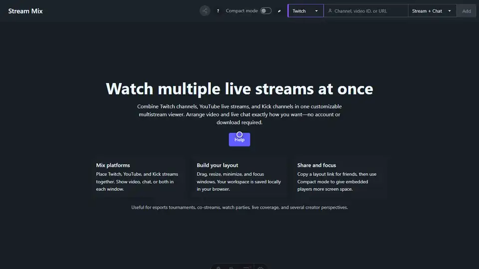

# Stream Mix

[](https://github.com/Qqkyu/stream-mixer/actions/workflows/ci.yml)

Stream Mix is a free, desktop-first multistream viewer for watching Twitch,
YouTube, and Kick together in one customizable browser workspace. It requires
no account, installation, or browser extension.

[Open Stream Mix](https://streammix.app) ·
[Setup guide](https://streammix.app/guides/watch-multiple-streams/) ·
[FAQ](https://streammix.app/faq/)

[](https://streammix.app)

## Highlights

- Combine Twitch, YouTube, and Kick embeds in the same workspace.
- Paste a supported URL or enter a channel name or YouTube video ID.
- Show **Stream + Chat**, **Stream**, or **Chat** in each window.
- Drag and resize windows in an expanding grid that compacts upward.
- Minimize windows to an auto-hiding shelf or focus one in fullscreen view.
- Use compact mode to hide the site and window headers while watching.
- Copy a link that recreates the streams and their layout for someone else.
- Restore streams, positions, sizes, minimized windows, and preferences after a
  reload using browser storage.
- See a platform-colored loading state while official embeds initialize.
  Video players request muted autoplay so several streams can start together.

Stream Mix embeds the players and chats supplied by each platform. Playback,
accounts, advertisements, and chat behavior remain under the platform's and
browser's control; Stream Mix does not proxy or restream broadcasts.

## Supported inputs

| Platform | Input                             | Available window modes      |
| -------- | --------------------------------- | --------------------------- |
| Twitch   | Channel name or channel URL       | Stream + Chat, Stream, Chat |
| YouTube  | Video ID, watch URL, or share URL | Stream + Chat, Stream, Chat |
| Kick     | Channel name or channel URL       | Stream + Chat, Stream, Chat |

## Using the mixer

1. Paste a stream URL, channel name, or YouTube video ID into the header.
2. Choose **Stream + Chat**, **Stream**, or **Chat**, then select **Add**.
3. Drag windows by their headers and resize them from either bottom corner.
4. Use the red control to remove a window, yellow to minimize it, and green to
   focus it in the workspace.
5. Use the share button to copy a link to the current layout.

Move the pointer to the bottom edge to reveal minimized windows. In compact
mode, move it to the top edge to reveal the button that restores the header.

## Local development

Requirements:

- Node.js 22.12 or newer
- pnpm 9.12.1 (the version declared in `package.json`)

Install dependencies and start the development server:

```sh
pnpm install
pnpm dev
```

The app is served at `http://localhost:4321` by default. Twitch and YouTube
embed URLs use the active hostname, so embeds work locally and in production.

Run the production build and Playwright regression tests with:

```sh
pnpm test
```

If Playwright cannot find a browser, install Chromium once with:

```sh
pnpm exec playwright install chromium
```

Build without running browser tests using:

```sh
pnpm build
```

CI runs the build and tests for pushes and pull requests to `main`. Dependabot
checks npm dependencies weekly.

## Regenerating the demo

Run:

```sh
pnpm capture:demo
```

The command creates a production build, starts a temporary preview server, and
writes the README animation and its MP4 source to `docs/assets/`. It requires
Google Chrome and FFmpeg. Set `CHROME_BIN`, `FFMPEG_BIN`, or
`STREAM_MIX_DEMO_URL` to override the detected commands or captured URL.

## Tech stack

- [Astro](https://astro.build) and [React](https://react.dev)
- [GridStack](https://gridstackjs.com)
- [Tailwind CSS](https://tailwindcss.com) and [DaisyUI](https://daisyui.com)
- [Nanostores](https://github.com/nanostores/nanostores)
- [Playwright](https://playwright.dev) for browser regression tests

## Data and privacy

Layouts and preferences stay in the current browser's `localStorage`. Shared
workspace links encode stream identifiers, display modes, and positions in the
URL fragment; that data is not uploaded to Stream Mix. There are no Stream Mix
accounts or automatic synchronization between devices. Clearing site data
resets the workspace.

Production builds can send sanitized application errors to Sentry when
`PUBLIC_SENTRY_DSN` is configured. Session replay, performance tracing, and
analytics are disabled. URL query strings and fragments are removed from error
reports so shared workspace data is not included.

## License

Stream Mix is available under the [MIT License](LICENSE.txt).
